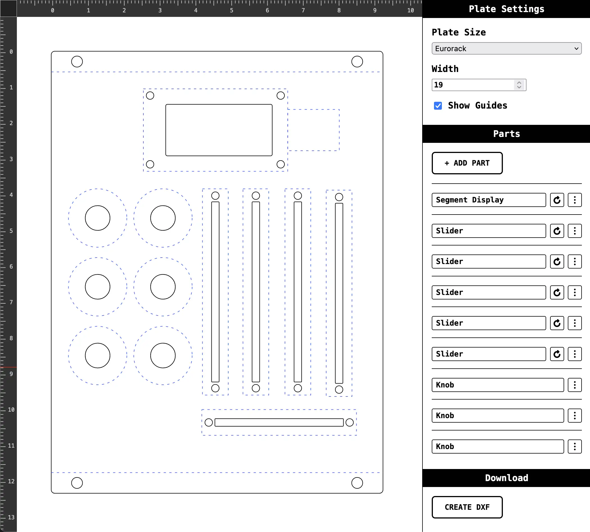

I've made a little tool with which you can design your own [19"](https://en.wikipedia.org/wiki/19-inch_rack) or [Eurorack](https://en.wikipedia.org/wiki/Eurorack) rackable plate.

After picking a size and placing parts you want to cut out you can download a .DXF format file to
send to you favourite laser cutting company, so they can turn it into an actual plate for you.

[Try the DIY Plate Designer here.](/designer) 

## Why this tool?

I've found it hard to start out working in CAD software. Every single one of these software packages
has way to many features for what I need. They are also not the most user-friendly to use for the
simplest of tasks.

This tool provides a very straight forward way of adding simple components and there respective
cutting lines on in a visual way.

## Who is this for?

If you want to design a 19" plate or Eurorack plate. It comes with pre-made mounting holes and
guides, so you know where it's safe to put components.

After you're done you can download a DXF file which can be used to send to laser cutting companies.

## Open Source

Of course, it's open source. [Take a peek](https://github.com/Gaya/wreckeys-site/tree/main/src).

## What components does it have?

Currently, it allows for sliders and knobs (potentiometers), segment display (with mounting holes),
circles (or holes, whatever you want to call it), and rectangles.

All rectangles can have rounded corners to better edges.

Drilling holes all have a bit of spacing to fit the screws.

## Future plans

I plan to integrate a shopping list tool that gathers parts you need in order to make use of the
cutting lines you add to the plate.
You'd have a list with number of knob potentiometers you need to order and how many caps for
instance.

I also plan to add more parts and make the user interface a bit more workable. Right now it is very
bare bones, but I believe it does the job.

## Suggestions?

Leave me a message through the form at the bottom.
