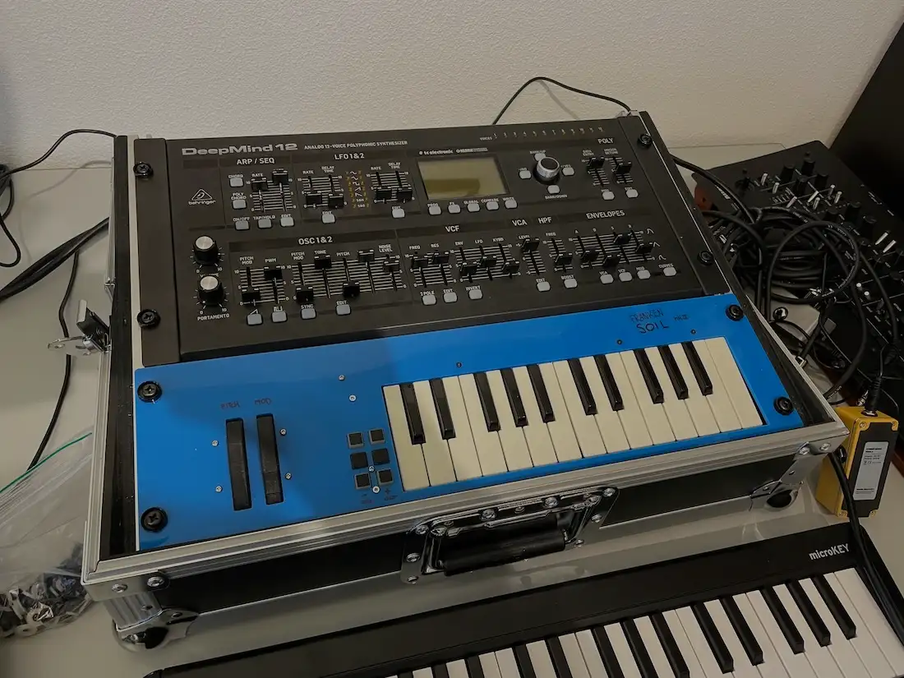
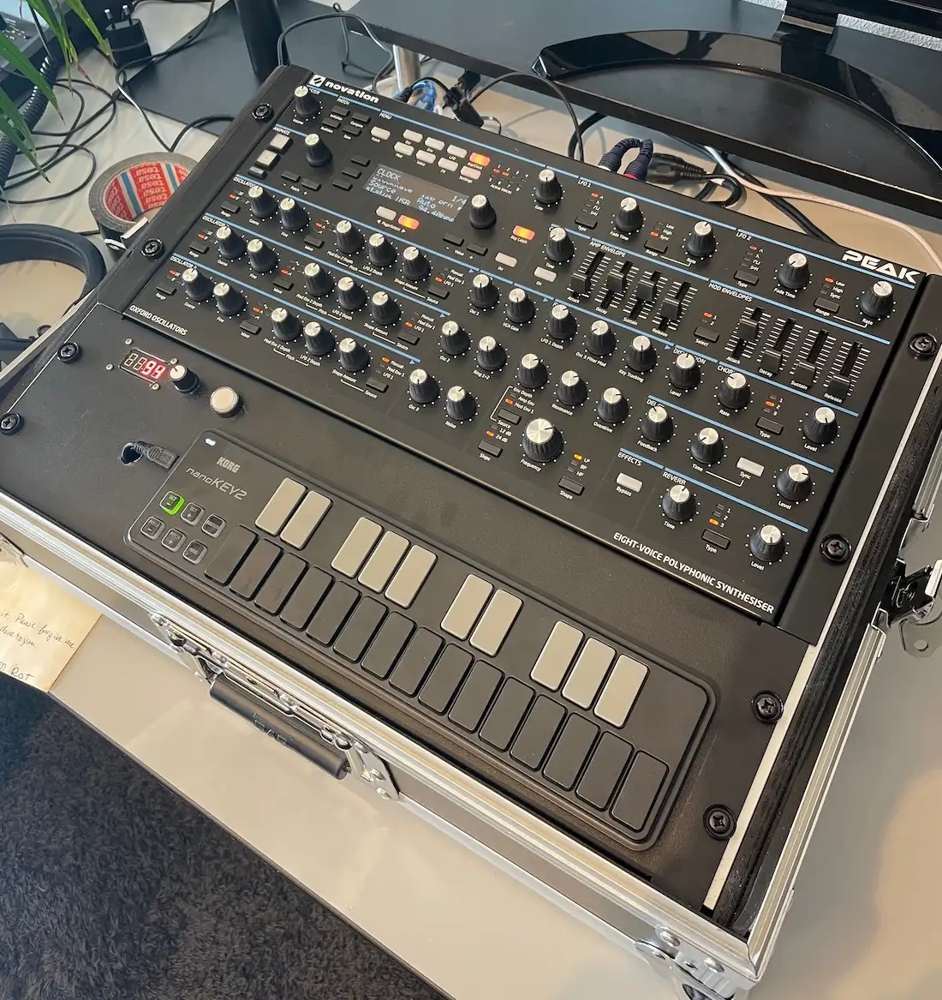
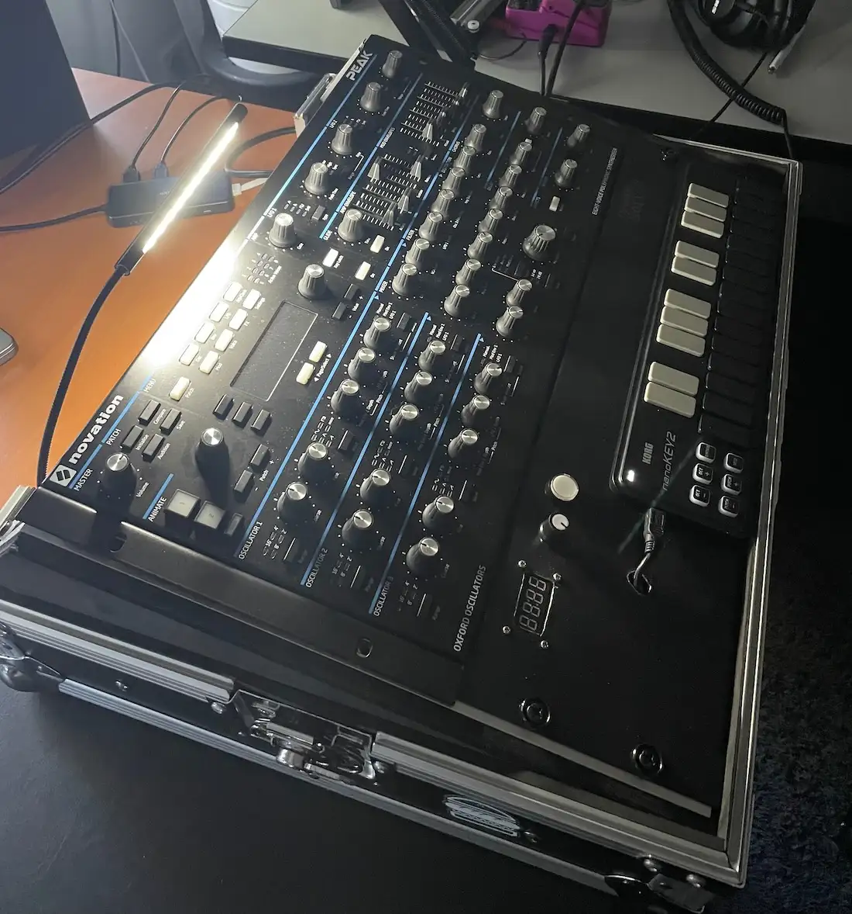
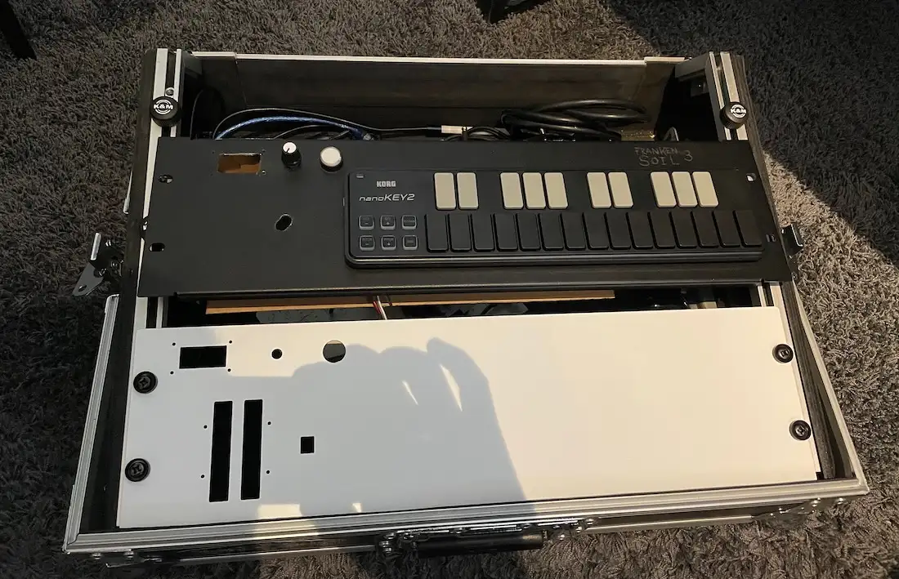
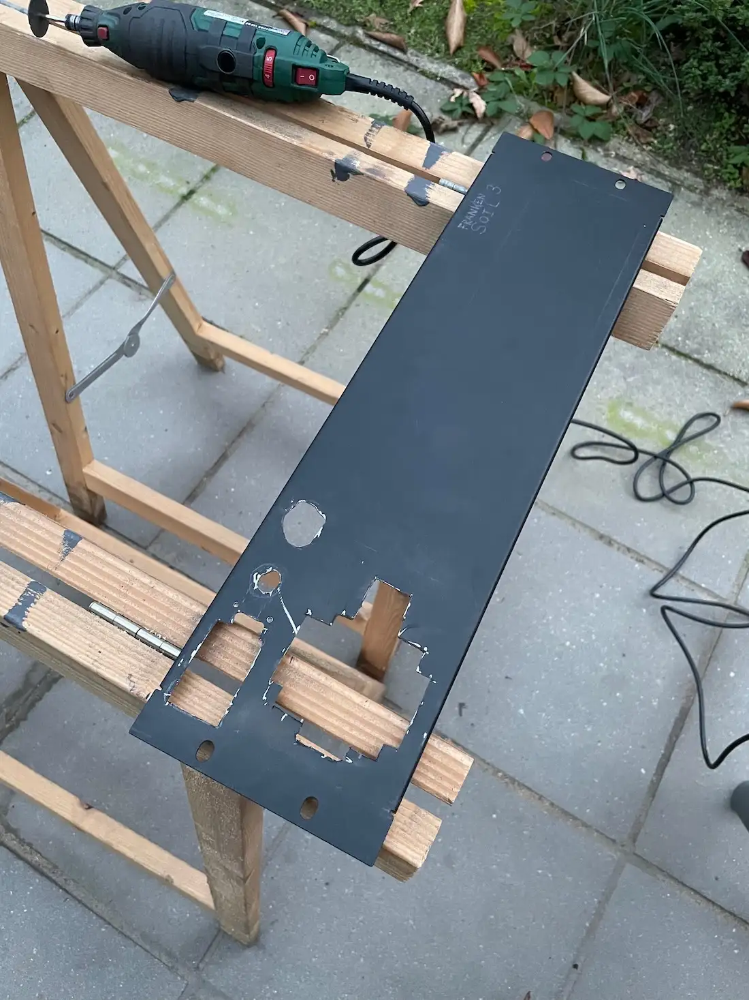
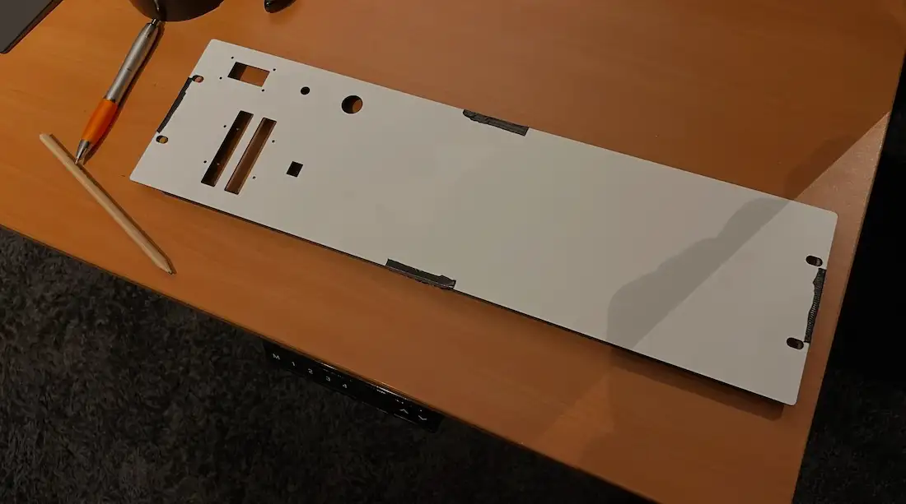
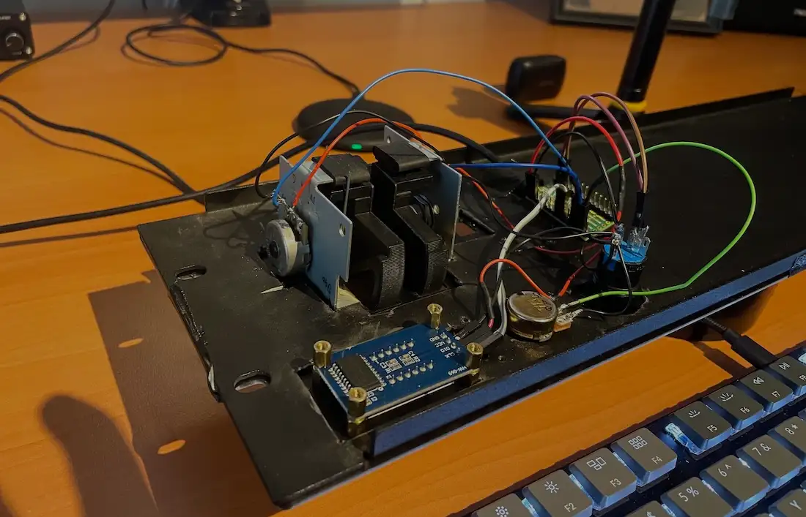
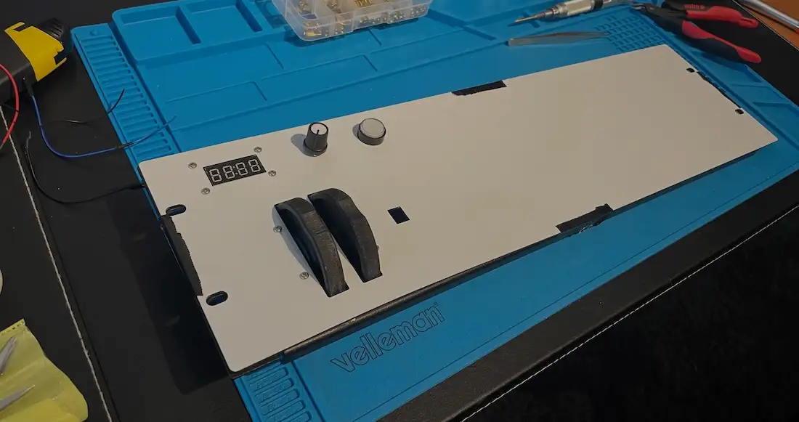
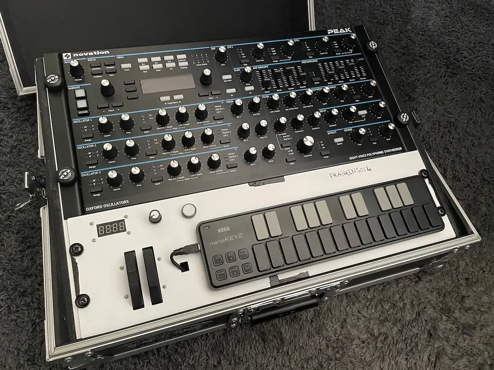

My first custom-made MIDI controller Frankensoil has gone through a couple of improvements over 
time. You can [read up on the original Frankensoil version 1](/frankensoil-1/) in a previous post. 

## Version 2.0, The Plastic One

The first version of Frankensoil was a hand-made plank with some components mounted to it. This was
not the best look, but it worked.

Then I found out the that guy we were doing [band practise](https://deadsoil.bio) at owns a laser 
cutter and actually cuts wood and plastics. This would be perfect as a face plate for Frankensoil so
I thought.

As it turns out the plastic used was not very sturdy and needed support in order for it to be
playable. Also not ideal... but the unit did look a lot better.

## Version 3.0, The Metal One

A while later I sold my DeepMind 12D in favour of a Novation Peak, which is a great new piece of 
gear I intend to keep using for much longer.

However, during live shows I used the "tap tempo" functionality of the DeepMind 12D to match up with
the tempo the music the rest of the band was playing live. The Novation Peak does not have a 
dedicated button for this. This meant I had to make my own.

I bought a blank metal 3U 19" faceplate and used a rotary tool to cut out holes for the components I
was going to use. Note that the pitch bend and mod wheel are missing as they were too much work to
cut out. I also added a simple Korg midi controller to input notes instead of the AKAI keybed I had
before.

The button on the top left is the tap tempo button. Press it a few times to the beat, and it will
match to the correct BPM. The display on the left will show the BPM and the button's LED will flash
to the beat as well for visual feedback. The knob is for manually setting the BPM, but I rarely use
it.

## Version 4.0, The Metal One With a Nice Finish

While version 3.0 was great, I really wanted to improve how the faceplate looked. You can never be 
as precise as a machine when you cut and drill out holes yourself. I was actually missing the sleek
look of version 2.0. Also, the pitch and MOD wheels were really nice to have.

So I learned to use CAD and ordered what I thought was a laser cut hard metal plate. I wanted to
test if this company was going to make parts I could use.

While the results of the cuts were perfect, the material was not what I expected. It was a bit
flimsy, but I could still use it with proper support. That gave me the idea of modding the plate of
version 3.0 to fit the holes of this clean version. So back to cutting (and swearing).

These cuts in combination with the white plate are plenty enough to support the flimsiness (is that 
a word?) of the white plate.

I lined of the white plate and started mounting on the components.

I was quite happy with the end result!

Then I quickly mounted it in my mixer case and voilà.

The pitch and MOD wheels are back. The display and button fit way better now too. And yes... I 
totally forgot to remove the ductape and glue the white plate to the metal one. I'll do that later.

I use this setup for practise and live performances as of late 2022, a year after the first version
of Frankensoil saw the day of light. Goes to show that the first usable version of something does
not have to be perfect, and I bet this version will be improved too.
