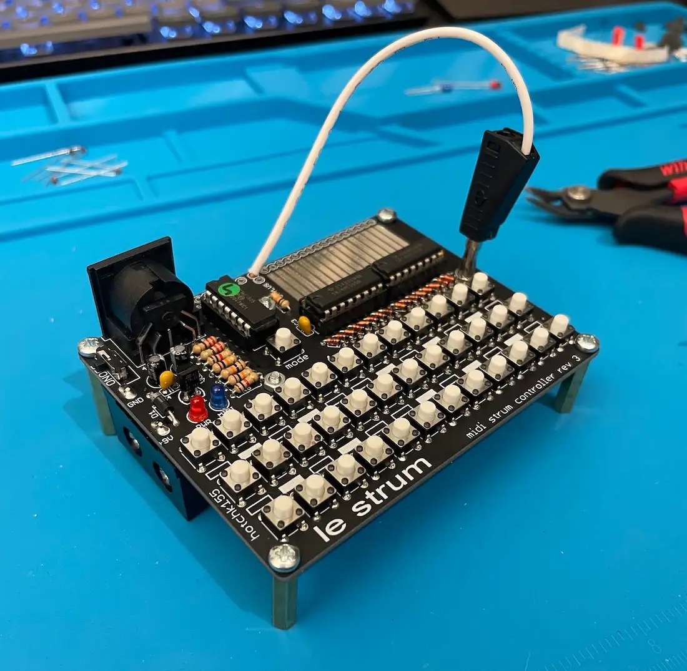
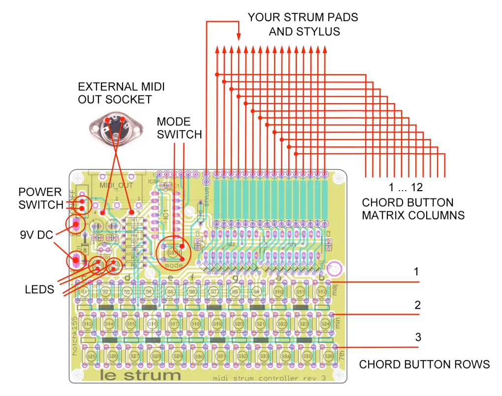
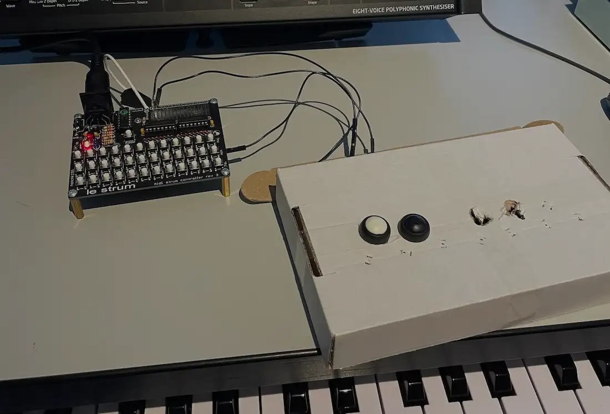
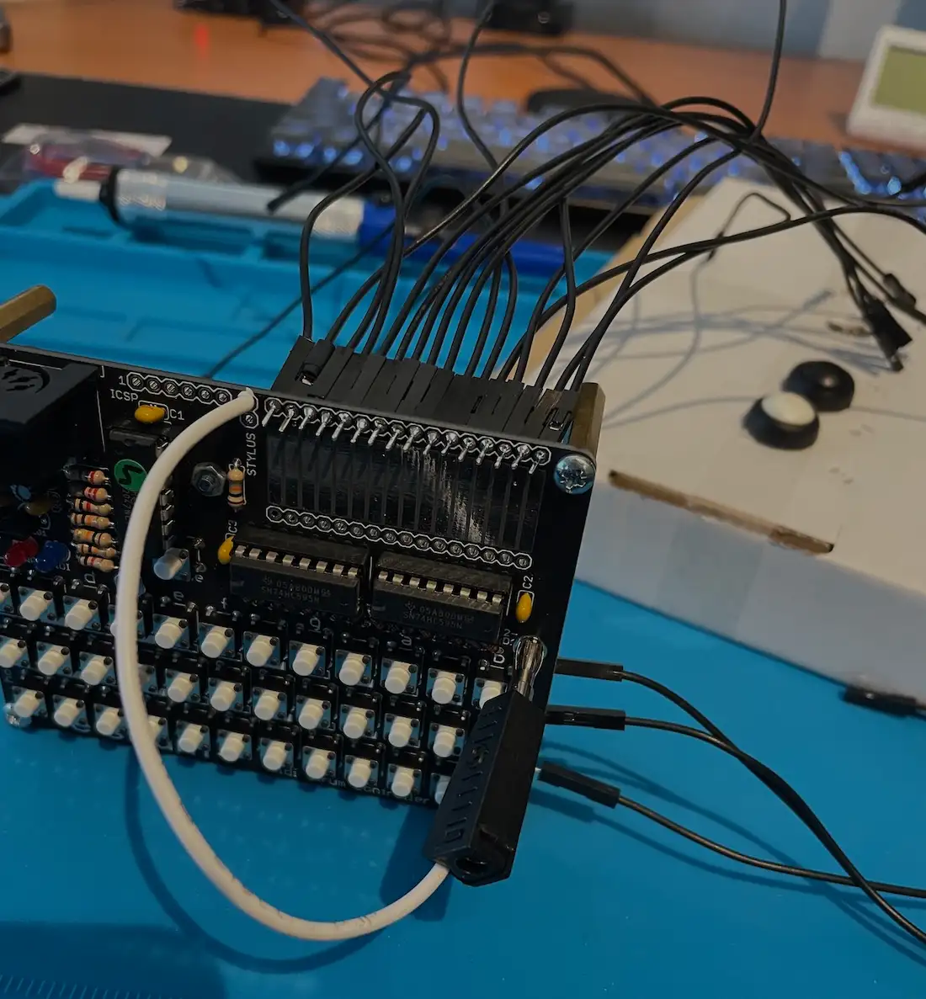
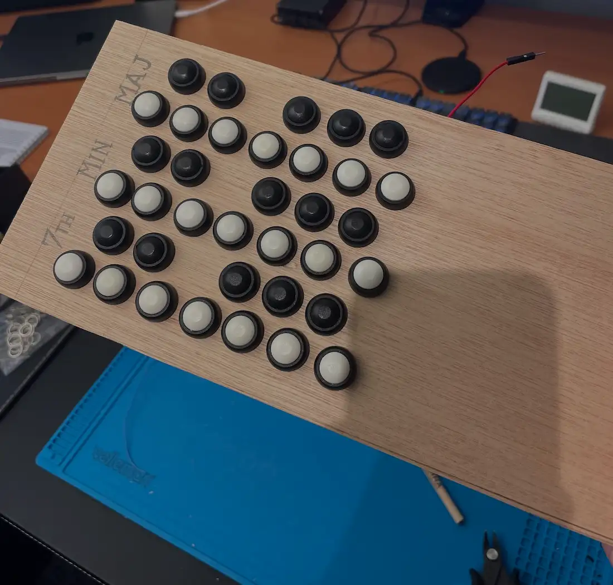
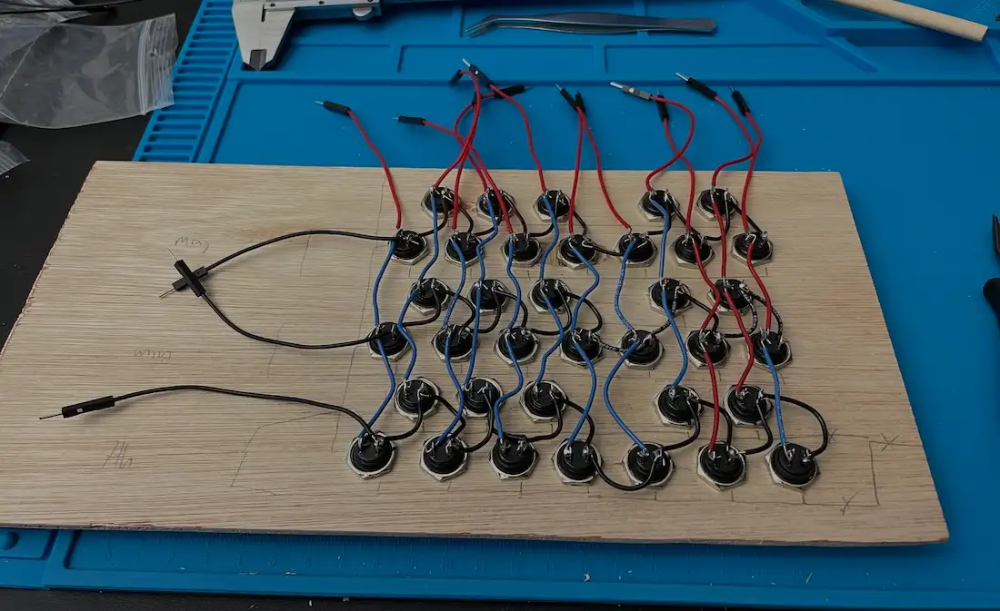
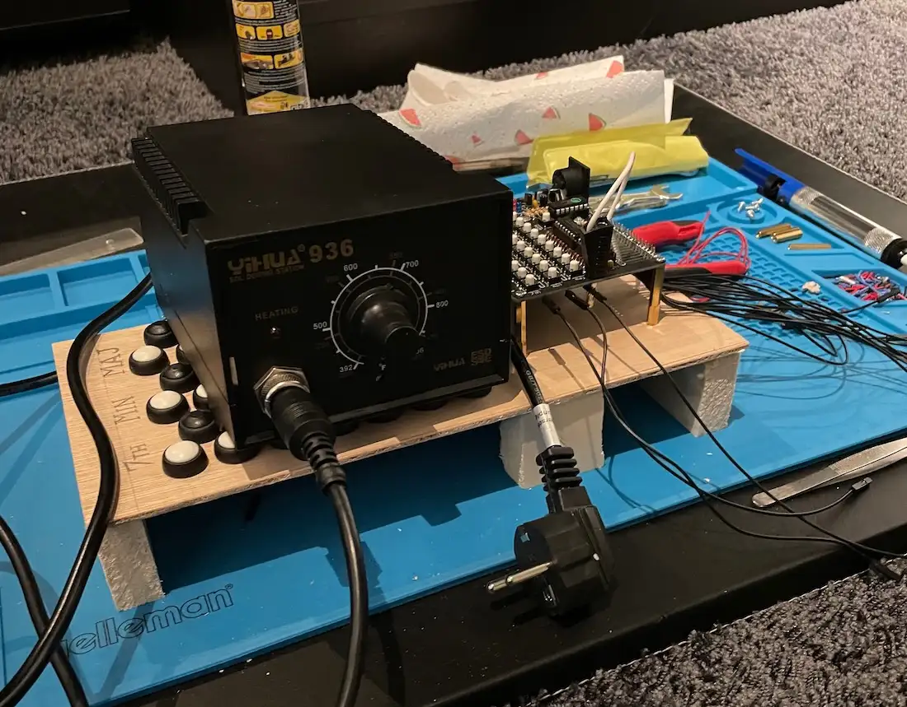
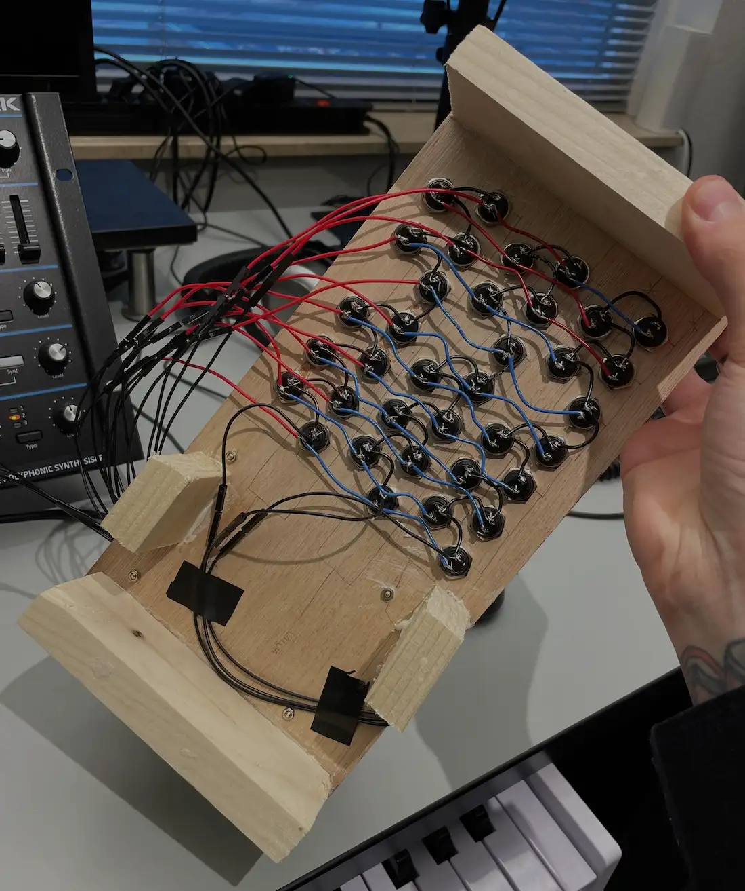
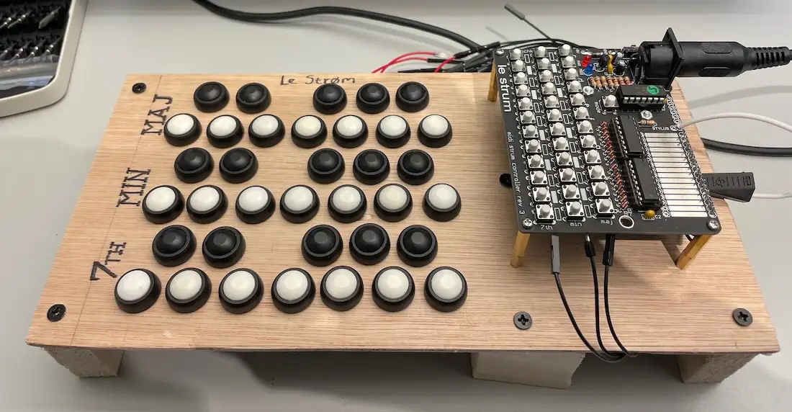

A while back I got a [Le Strum by Sixty Four Pixels](https://six4pix.net/product/lestrum/) which is 
a nice and fun way to play strumming style MIDI notes to your instruments. It really does give it
that extra little something compared to a traditional keyboard input.

The only problem with this device however is that the teeny tiny notes make it quite hard for my
hands to play. Luckily the Le Strum was made to be hacked! Which is what I set out to do.

I'll get myself a wooden plank, drill holes for new buttons, and fit everything so the Le Strum will
be a lot easier to handle.

## How to Hack

On Le Strum's page you can find an explanation of how to add external buttons to the device to be
able to make note input easier.

This is the image on the "Hints for Mods" page. What it explains is that we need to look at the
buttons as a matrix. The "rows" of buttons will all connect from the "ground" of the inputs on the 
Le Strum and all the "columns", or groups of three of the same notes in each "row", will connect to 
their respective connection on the stylus pad.

After a quick test on a cardboard box (oh how I love to prototype with cardboard) and verifying that
I understood the task at hand it was time to go ahead and make the actual new keyboard.

## The Chord Input Heads

I like to work with jumper cables as they make it easy to plug and unplug connections I made. The
male ends of jumper wires fit perfectly in the chords connection holes. Soldered all the holes with
jumper cables.

A nice added feature of this is that I can use the pins as an input point for the stylus. This means
I'll get actual physical feedback while playing the instrument.

## Arranging the Buttons

I got a plank of wood and made holes for the three scales of inputs. This time with a similar layout
to an actual keyboard instead of a row of buttons.

Then on the other side I connected all the ground connections of the buttons (black wires) per row.
It does not matter which side of the button you choose to connect as they are NO (normally open)
switches. This means that currently there is no connection between the left and right leg where you
can connect the wires. Once the button is pressed a connection is made allowing a current from one
end to the other.

After that I wired all the vertical columns of notes and attached jumper wires to the end of each
row and column I was going to connect to the Le Strum.

## Time to Fit on the Le Strum

I wanted the Le Strum to sit on the input plank next to the input buttons, so I drilled some holes
where I could attach the mounting legs of the Le Strum onto.

Quickly sawed off some legs to be put on the plank and glued them. Since I wasn't using it anymore I
used the soldering station as my drying weight.

After drying and putting the Le Strum in place I connected all the wires and it looks like a
glorious mess.

A look at the bottom.

And while playing.

And so it was born. Le Strøm.


